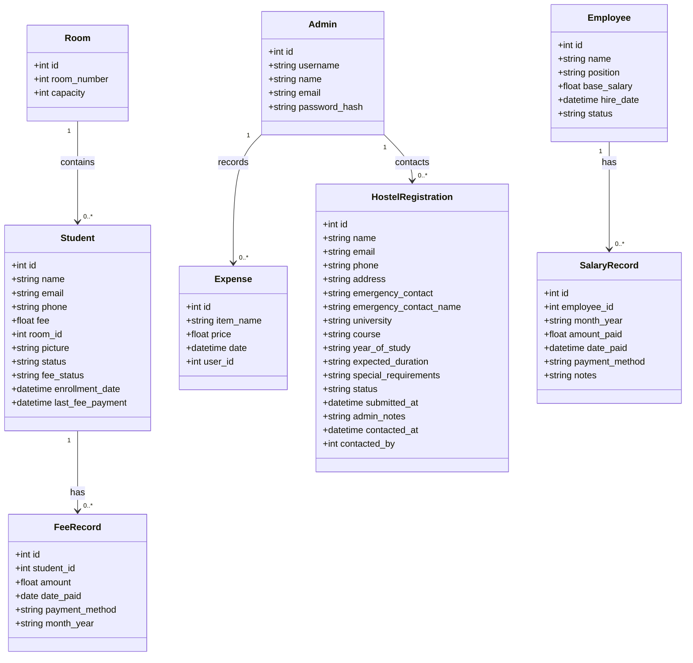
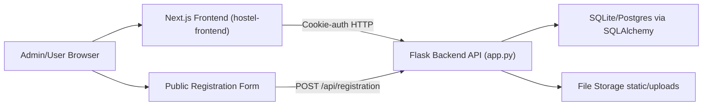
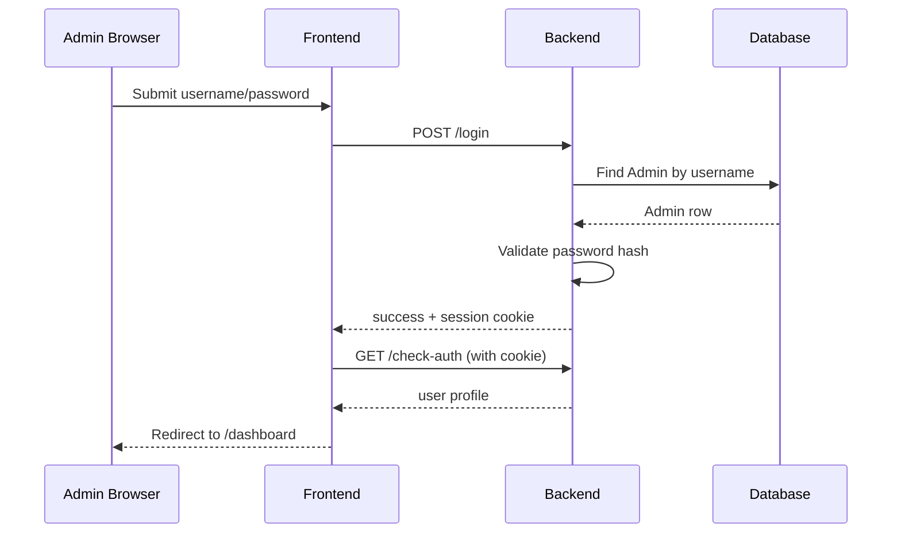
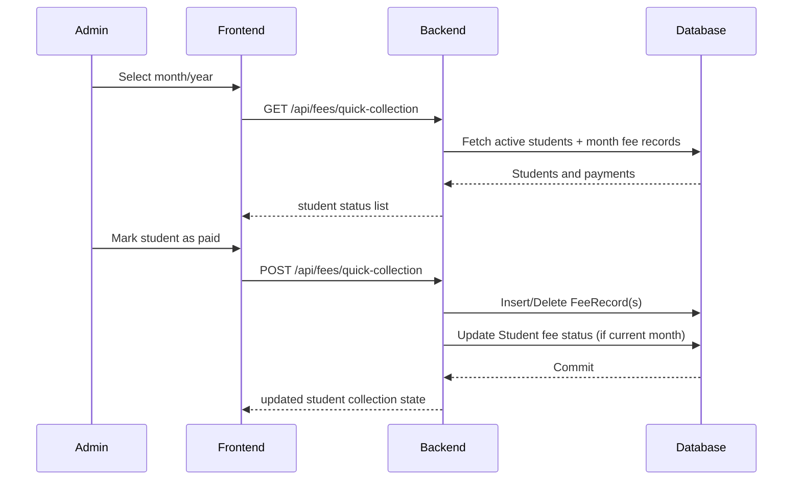
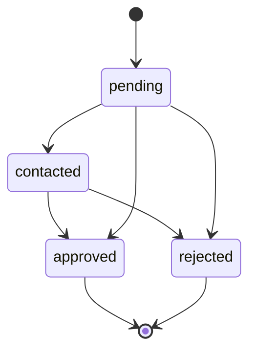

# Roomigo UML Diagrams

## 1. Domain Class Diagram

```mermaid
classDiagram
    class Admin {
      +int id
      +string username
      +string name
      +string email
      +string password_hash
    }

    class Room {
      +int id
      +int room_number
      +int capacity
    }

    class Student {
      +int id
      +string name
      +string email
      +string phone
      +float fee
      +int room_id
      +string picture
      +string status
      +string fee_status
      +datetime enrollment_date
      +datetime last_fee_payment
    }

    class FeeRecord {
      +int id
      +int student_id
      +float amount
      +date date_paid
      +string payment_method
      +string month_year
    }

    class Expense {
      +int id
      +string item_name
      +float price
      +datetime date
      +int user_id
    }

    class Employee {
      +int id
      +string name
      +string position
      +float base_salary
      +datetime hire_date
      +string status
    }

    class SalaryRecord {
      +int id
      +int employee_id
      +string month_year
      +float amount_paid
      +datetime date_paid
      +string payment_method
      +string notes
    }

    class HostelRegistration {
      +int id
      +string name
      +string email
      +string phone
      +string address
      +string emergency_contact
      +string emergency_contact_name
      +string university
      +string course
      +string year_of_study
      +string expected_duration
      +string special_requirements
      +string status
      +datetime submitted_at
      +string admin_notes
      +datetime contacted_at
      +int contacted_by
    }

    Room "1" --> "0..*" Student : contains
    Student "1" --> "0..*" FeeRecord : has
    Admin "1" --> "0..*" Expense : records
    Employee "1" --> "0..*" SalaryRecord : has
    Admin "1" --> "0..*" HostelRegistration : contacts
```

## 2. High-Level Component Diagram

```mermaid
flowchart LR
    U["Admin/User Browser"] --> F["Next.js Frontend (hostel-frontend)"]
    U --> P["Public Registration Form"]
    F -->|"Cookie-auth HTTP"| B["Flask Backend API (app.py)"]
    P -->|"POST /api/registration"| B
    B --> D["SQLite/Postgres via SQLAlchemy"]
    B --> S["File Storage static/uploads"]
```

## 3. Login Sequence Diagram

```mermaid
sequenceDiagram
    participant A as Admin Browser
    participant F as Frontend
    participant B as Backend
    participant DB as Database

    A->>F: Submit username/password
    F->>B: POST /login
    B->>DB: Find Admin by username
    DB-->>B: Admin row
    B->>B: Validate password hash
    B-->>F: success + session cookie
    F->>B: GET /check-auth (with cookie)
    B-->>F: user profile
    F-->>A: Redirect to /dashboard
```

## 4. Quick Fee Collection Sequence

```mermaid
sequenceDiagram
    participant A as Admin
    participant F as Frontend
    participant B as Backend
    participant DB as Database

    A->>F: Select month/year
    F->>B: GET /api/fees/quick-collection
    B->>DB: Fetch active students + month fee records
    DB-->>B: Students and payments
    B-->>F: student status list

    A->>F: Mark student as paid
    F->>B: POST /api/fees/quick-collection
    B->>DB: Insert/Delete FeeRecord(s)
    B->>DB: Update Student fee status (if current month)
    DB-->>B: Commit
    B-->>F: updated student collection state
```

## 5. Registration State Diagram

```mermaid
stateDiagram-v2
    [*] --> pending
    pending --> contacted
    contacted --> approved
    contacted --> rejected
    pending --> approved
    pending --> rejected
    approved --> [*]
    rejected --> [*]
```
